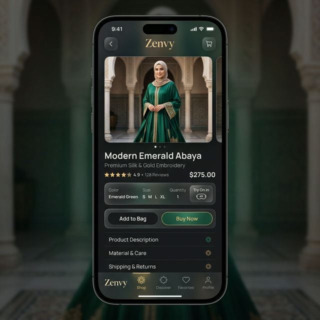
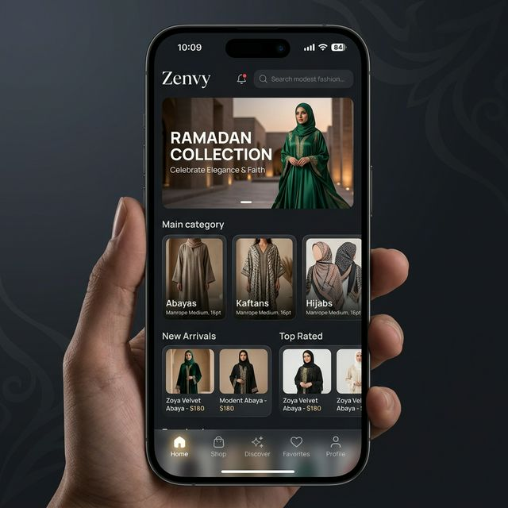
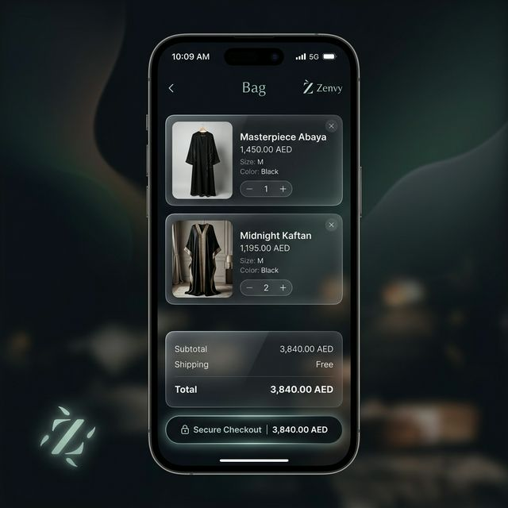
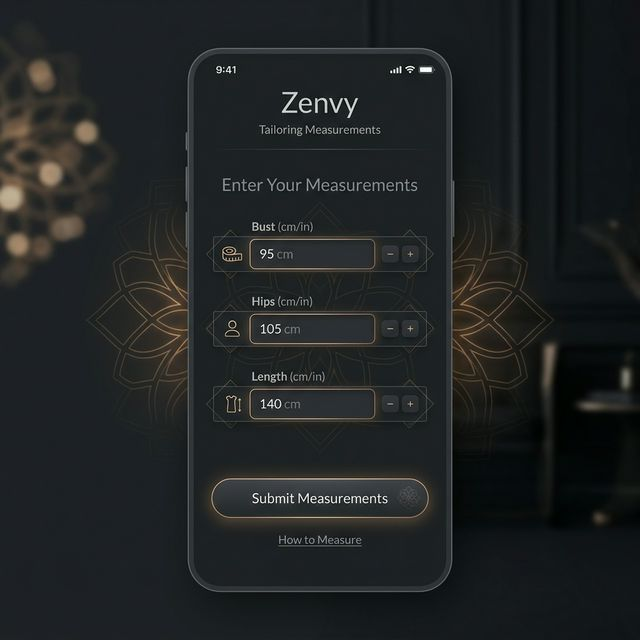
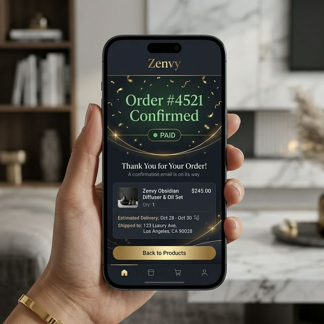
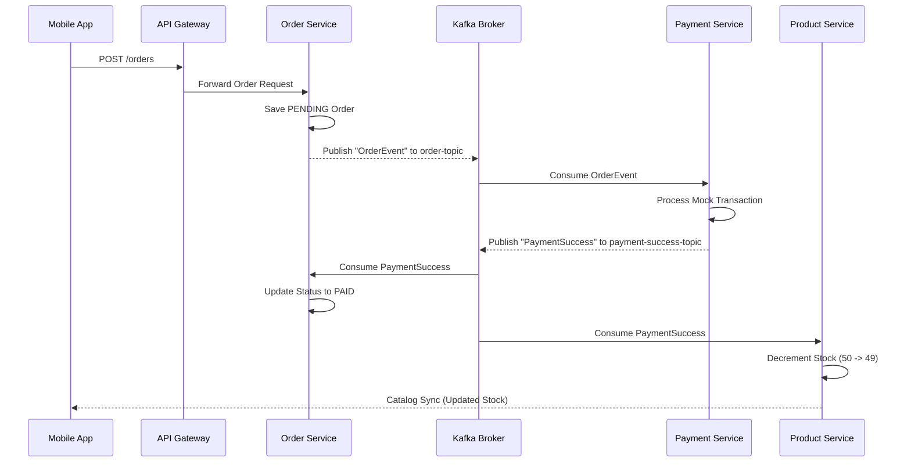

# Zenvy: Premium Modest Fashion Marketplace 🌙



## 🏆 Project Vision
Zenvy is a high-fidelity, production-grade **Modest Fashion Marketplace** built on a scalable microservices architecture. It combines modern aesthetics (Glassmorphism, Manrope typography) with a robust event-driven backend supporting high-concurrency order processing and inventory synchronization.

---

## 🖼️ Visual Journey

| Home & Discovery | Product & Detail |
| :---: | :---: |
|  |  |

| Shopping Bag | Custom Tailoring |
| :---: | :---: |
|  |  |

| Order Success (PAID) |
| :---: |
|  |

---

## 🏗️ Technical Architecture
The system is built using a **Spring Boot** backend cluster unified by an **API Gateway** and **Service Discovery**, integrated with a **React Native (Expo)** mobile frontend.

### 🧩 Core Microservices
| Service | Technology | Responsibility |
| :--- | :--- | :--- |
| **API Gateway** | Spring Cloud Gateway | Entry point, Load balancing, Unified routing. |
| **Auth Service** | Spring Security + JWT | Identity, RBAC, Admin escalation (auto-role for `admin@`). |
| **Product Service** | Redis + PostgreSQL | Catalog, Featured/Trending curation, Stock management. |
| **Cart Service** | PostgreSQL | User personal shopping bag management. |
| **Order Service** | Kafka + Hibernate | Saga orchestration, Fulfillment workflow. |
| **Payment Service** | Kafka + Mock API | Transaction processing & Saga state heartbeats. |

---

## 🔄 Business Workflow: "The Zenvy Saga"
The marketplace uses a **Choreography-based Saga Pattern** to ensure data consistency across distributed databases during order placement.



---

## 🚀 Final Production Flow Verification
We have successfully validated the following end-to-end journey:
1.  **Auth Persistence**: `admin@zenvy.com` successfully registered as **`ROLE_ADMIN`**.
2.  **Catalog Success**: **Masterpiece Abaya (ID: 9)** correctly featured in the marketplace catalog.
3.  **Order Success**: Order #7 successfully placed via mobile UI.
4.  **Saga Success**: Kafka heartbeats successfully updated **Status: PAID** and reduced **Stock from 50 to 49**.

---

## 🛠️ Deployment & Launch
### 1. Backend Cluster (Docker)
```powershell
cd backend
docker-compose build
docker-compose up -d
```
Accessible at: `http://localhost:8080` (Discovery at `8761`)

### 2. Mobile App (Expo)
```powershell
npx expo start
```
Connect using the Expo Go app. The `baseURL` is automatically configured to point to your machine's local IP.

---

### **🌟 Key Features**
*   **AR Try-On Integration**: Ready for mobile AR overlays.
*   **Custom Tailoring**: Precision measurement captures for bespoke abayas.
*   **Performance**: Sub-100ms catalog retrieval via Redis.
*   **Resilience**: Event-driven inventory ensures no double-selling.

**Crafted with excellence by Antigravity AI.**
